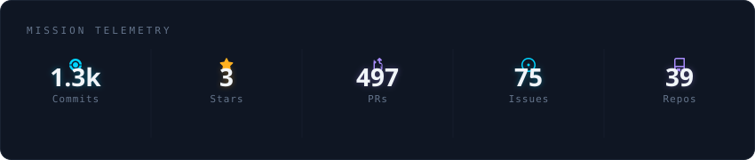

<!-- Galaxy Profile SVGs — gerados automaticamente pelo GitHub Action -->

---

## 🌌 Tech Stack Galaxy

<!-- Tech stack gerado automaticamente -->

---

## 📈 Mission Telemetry

<!-- Stats card gerado automaticamente -->

---

## 🚀 Featured Systems

<!-- Projetos gerados automaticamente -->

---

## 📫 Contact

- ✉️ Email: [Jaime.silva.ferreira2@gmail.com](mailto:Jaime.silva.ferreira2@gmail.com)
- 🔗 LinkedIn: [linkedin.com/in/jaime-da-silva-ferreira-982142329](https://www.linkedin.com/in/jaime-da-silva-ferreira-982142329)

---

## 🛠️ Technical Skills

### 💻 Programming Languages
- PHP         
- Java        
- TypeScript  
- JavaScript  
- CSS         

### ⚛️ Frameworks & Libraries
- Laravel      
- Spring Boot  
- React        
- Next.js      
- Node.js      
- Tailwind CSS 

### 🗄️ Databases
- PostgreSQL  
- Oracle      
- MySQL       
- MariaDB     

### ☁️ DevOps & Infrastructure

### 🖥️ Operating Systems
- Windows (Advanced)  
- Linux (Advanced)    

---