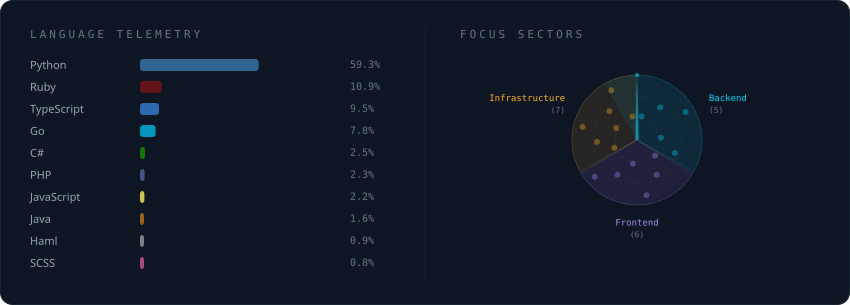
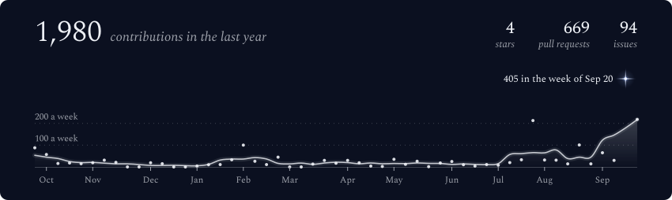
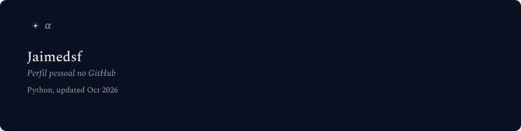

<!-- Galaxy Profile SVGs — gerados automaticamente pelo GitHub Action -->
<picture>
  <source media="(max-width: 600px) and (prefers-color-scheme: light)" srcset="./assets/generated/galaxy-header-mobile-light.svg">
  <source media="(max-width: 600px)" srcset="./assets/generated/galaxy-header-mobile.svg">
  <source media="(prefers-color-scheme: light)" srcset="./assets/generated/galaxy-header-light.svg">
  
</picture>

---

## 🌌 Tech Stack Galaxy

<!-- Tech stack gerado automaticamente -->
<picture>
  <source media="(max-width: 600px) and (prefers-color-scheme: light)" srcset="./assets/generated/tech-stack-mobile-light.svg">
  <source media="(max-width: 600px)" srcset="./assets/generated/tech-stack-mobile.svg">
  <source media="(prefers-color-scheme: light)" srcset="./assets/generated/tech-stack-light.svg">
  
</picture>

---

## 📈 Mission Telemetry

<!-- Stats card gerado automaticamente -->
<picture>
  <source media="(max-width: 600px) and (prefers-color-scheme: light)" srcset="./assets/generated/stats-card-mobile-light.svg">
  <source media="(max-width: 600px)" srcset="./assets/generated/stats-card-mobile.svg">
  <source media="(prefers-color-scheme: light)" srcset="./assets/generated/stats-card-light.svg">
  
</picture>

---

## 🚀 Featured Systems

<!-- Projetos gerados automaticamente -->
<picture>
  <source media="(max-width: 600px) and (prefers-color-scheme: light)" srcset="./assets/generated/projects-constellation-mobile-light.svg">
  <source media="(max-width: 600px)" srcset="./assets/generated/projects-constellation-mobile.svg">
  <source media="(prefers-color-scheme: light)" srcset="./assets/generated/projects-constellation-light.svg">
  
</picture>

---

## 📫 Contact

- ✉️ Email: [Jaime.silva.ferreira2@gmail.com](mailto:Jaime.silva.ferreira2@gmail.com)
- 🔗 LinkedIn: [linkedin.com/in/jaimedsf](https://www.linkedin.com/in/jaimedsf)

---

## 🛠️ Technical Skills

### 💻 Programming Languages
- PHP         
- Java        
- TypeScript  
- JavaScript  
- CSS         

### ⚛️ Frameworks & Libraries
- Laravel      
- Spring Boot  
- React        
- Next.js      
- Node.js      
- Tailwind CSS 

### 🗄️ Databases
- PostgreSQL  
- Oracle      
- MySQL       
- MariaDB     

### ☁️ DevOps & Infrastructure

### 🖥️ Operating Systems
- Windows (Advanced)  
- Linux (Advanced)    

---
